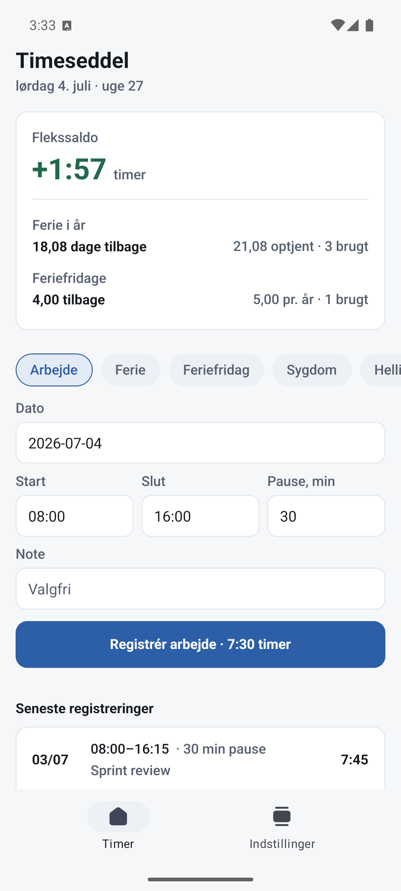
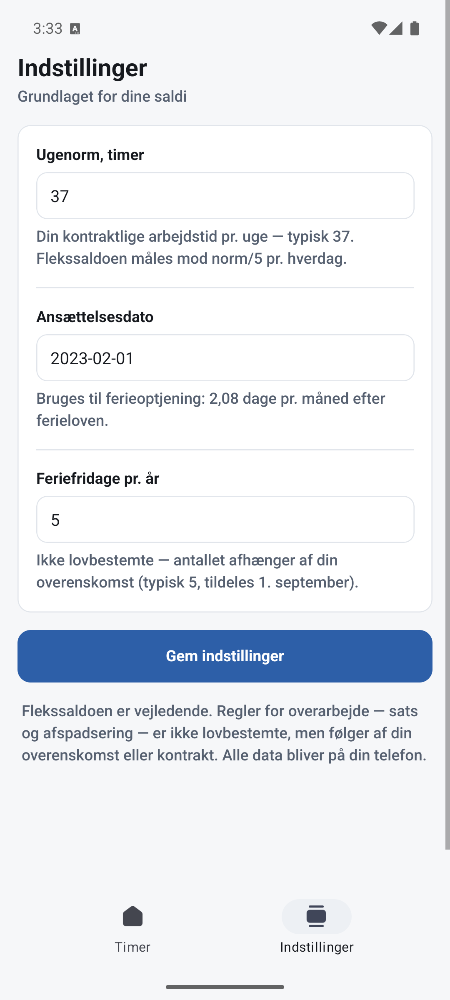
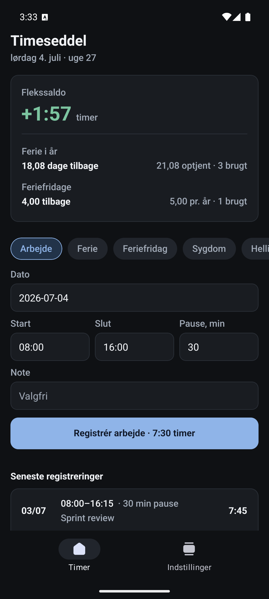

# Timeseddel

Offline-first work-hours & holiday tracker for Danish workers — log hours (manually or by voice), track ferie/overtime accrual, and ask an AI assistant questions about Danish workplace rights.

> **Status: in active development.** Built as a portfolio piece in a deliberately chosen production stack: React Native, Expo, TypeScript, Redux Toolkit, offline SQLite, Sentry.

<table>
  <tr>
    <td></td>
    <td></td>
    <td></td>
  </tr>
</table>

## Why this app

Work hours, holiday accrual, and workplace rights are things every Danish employee deals with — and the data is personal, so it stays **on your device**. No account, no cloud sync, no tracking. The only network call is the (anonymous) AI Q&A, proxied through an edge function so no API key ever ships in the app.

## Stack

| Layer | Choice |
|---|---|
| Framework | React Native 0.86 / Expo SDK 57 (New Architecture) |
| Language | TypeScript (strict) |
| State | Redux Toolkit + react-redux |
| Storage | expo-sqlite + Drizzle ORM (offline source of truth) |
| Voice input | expo-speech-recognition (on-device STT) |
| AI Q&A | Mistral (EU data residency) via server-side edge proxy |
| Error reporting | Sentry (@sentry/react-native) |
| Build & distribution | EAS Build — installable Android APK |

## Architecture

```
[Expo app]  RTK (UI/sync state) + Drizzle/expo-sqlite (offline source of truth)
     │  voice → expo-speech-recognition (on-device, free)
     │  HTTPS POST /chat  (no secret in the app)
     ▼
[Edge proxy]  holds MISTRAL_API_KEY server-side
     ▼
[api.mistral.ai]  EU data residency
```

Key decisions:

- **Offline-first.** SQLite is the source of truth; the app is fully functional with no connection.
- **No API keys in the bundle.** `EXPO_PUBLIC_*` vars are inlined as plaintext — the Mistral key lives only in the edge function.
- **No user accounts.** Records are local; the AI proxy is rate-limited by an anonymous device token.

## Roadmap

- [x] Phase 0 — Scaffold: Expo SDK 57 + TypeScript, Sentry wiring, EAS build profiles
- [x] Phase 1 — Hours model: Drizzle/expo-sqlite CRUD, RTK store, unit tests on ferie/overtime accrual logic
- [x] Phase 2 — UI polish: Danish UI, design pass, screenshots
- [x] Phase 3 — Device build: EAS preview APK, verified Sentry catches a real on-device crash with a source-mapped stack trace (exact file + line)
- [ ] Phase 4 — AI Q&A: Danish workplace-rights assistant via Mistral edge proxy
- [ ] Phase 5 — Voice logging: on-device speech recognition

## Why no store listing?

Deliberate scope call, not a gap: this is a personal-device portfolio build, so it ships as an installable APK via EAS internal distribution (`eas build -p android --profile preview`). Skipping Google Play avoids the closed-testing gate and account overhead for a single-user app; the EAS submit pipeline is the same regardless.

## Getting started

```bash
npm install
npx expo start        # dev server (storage & UI work in Expo Go; voice needs a dev client)
npm test              # unit tests (ferielov accrual engine)
npx tsc --noEmit      # typecheck
npx expo lint         # eslint
```

The vacation accrual engine (`src/domain/accrual.ts`) encodes the current Danish Holiday Act (ferieloven, LBK nr. 152 af 20/02/2024): 2.08 days per employment month with 0.07/day proration for partial months, ferieår 1 Sept–31 Aug, and a full year rounding 24.96 up to the statutory 25. Overtime has no statutory basis in Denmark, so the app reports a neutral, configurable flex balance instead of assuming any overenskomst's rates — the assumptions are documented in the module and surfaced in the UI.

Optional env (see `.env.example`):

- `EXPO_PUBLIC_SENTRY_DSN` — enables Sentry; error reporting is disabled when unset.

Android APK build:

```bash
eas build -p android --profile preview
```
